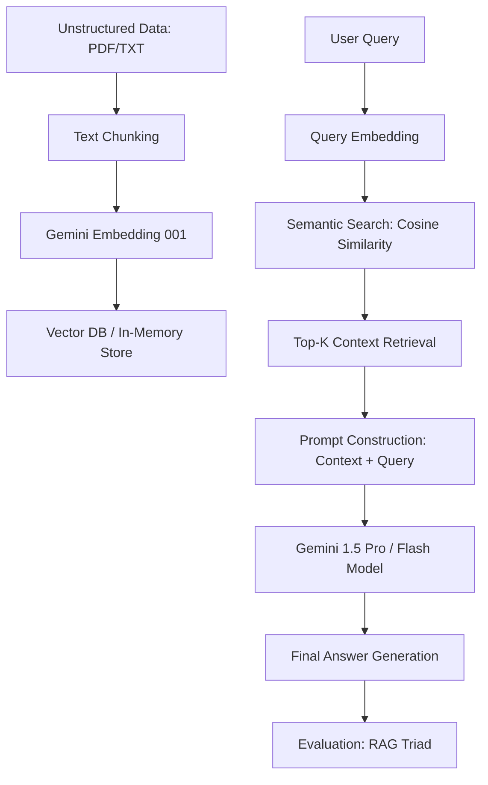

# 🤖 Generative AI Lab Experiments (LLM 2nd Sem)

[](https://github.com/Soum-Code/GenAI-Lab-Experiments/blob/main/LICENSE)
[](https://www.python.org/)
[](https://ai.google.dev/)

A professional, comprehensive collection of 11 practical experiments for students specializing in **Large Language Models (LLM)**. This repository covers everything from basic parameter tuning to building advanced Retrieval-Augmented Generation (RAG) systems.

---

## 📌 Table of Contents
1.  [Project Overview](#-project-overview)
2.  [System Architecture (RAG Workflow)](#-system-architecture-rag-workflow)
3.  [Technology Stack](#-technology-stack)
4.  [Experiment Deep Dive (Descriptions & SLOs)](#-experiment-deep-dive-descriptions--slos)
5.  [Getting Started](#-getting-started)
6.  [Project Workflow](#-project-workflow)
7.  [License](#-license)

---

## 📖 Project Overview
This repository provides a hands-on learning environment for modern Generative AI. The experiments are designed to guide students through:
- **Prompt Engineering**: Mastering Zero-shot, Few-shot, and Chain-of-Thought (CoT).
- **Retrieval Systems**: Implementing keyword-based and semantic vector search.
- **Data Automation**: Generating synthetic datasets and parsing clinical reports.
- **Evaluation**: Quantifying AI performance using the RAG Triad.

---

## 🏗 System Architecture (RAG Workflow)

The following diagram illustrates the core RAG pipeline implemented in **Experiment 7 and 8**:



---

## 🛠 Technology Stack
- **Languages**: Python 3.8+
- **LLM/Embeddings**: Google Generative AI (Gemini SDK)
- **Data Processing**: `PyMuPDF` (Clinical PDF Parsing), `NumPy` (Vector Math)
- **Strucutured Data**: `openpyxl` (Excel Automation)
- **Evaluations**: Custom LLM-as-a-judge scoring frameworks.

---

## 🔬 Experiment Deep Dive (Descriptions & SLOs)

| Experiment | Focus Area | Description | Student Learning Outcome (SLO) |
| :--- | :--- | :--- | :--- |
| **Exp 1** | **LLM Params** | Compares `temperature` and `top_p` variations. | Understand stochastic vs. deterministic AI generation. |
| **Exp 2** | **QA Metrics** | Automated scoring for Toxicity, Bias, and Fluency. | Build automated quality gates for model evaluation. |
| **Exp 3** | **Lexical Search**| Traditional BM25/Keyword identification. | Recognize the limitations of exact-match retrieval. |
| **Exp 4** | **Semantic Search**| Vector embeddings + Cosine Similarity. | Learn to perform intent-based semantic retrieval. |
| **Exp 5** | **Document AI** | Parsing and structuring medical reports from PDFs.| Apply clinical data extraction with domain-aware LLMs. |
| **Exp 6** | **Dataset Gen** | Synthetic Q&A bank exported to Excel. | Automate high-quality dataset creation for ML. |
| **Exp 7** | **RAG Pipeline** | End-to-end documentation retrieval answering. | Construct full-chain retrieval-augmented applications. |
| **Exp 8** | **RAG Triad** | Faithfulness, Relevance, and Context Precision. | Quantify retrieval quality and mitigate hallucinations. |
| **Exp 11** | **Prompt Strat** | Zero-shot vs. Few-shot comparisons. | Master context-window engineering for performance. |
| **Exp 12** | **CoT Prompting** | Reasoning-path elicitation for logic tasks. | Design reasoning chains for complex task execution. |
| **Exp 13** | **Fine-Tuning** | Supervised Fine-Tuning (SFT) data prep logic. | Understand the lifecycle of specialty model alignment. |

---

## 🚀 Getting Started

### 1. Prerequisites
- Python 3.8 or higher.
- A Google Cloud/AI Studio account for the [Gemini API Key](https://aistudio.google.com/).

### 2. Installation
```bash
# Clone the repository
git clone https://github.com/Soum-Code/GenAI-Lab-Experiments.git
cd GenAI-Lab-Experiments

# Install required packages
pip install google-generativeai pymupdf numpy openpyxl
```

### 3. Configuration
Each script contains a configuration section. Replace the placeholder with your API Key:
```python
API_KEY = "YOUR_GEMINI_API_KEY"
```

---

## 🔄 Project Workflow
The labs follow a progressive path:
1.  **Level 1 (Foundations)**: Parameters and basic prompting (1, 11, 12).
2.  **Level 2 (Data Engineering)**: Parsing medical documents and generating datasets (5, 6).
3.  **Level 3 (Search & Retrieval)**: Comparing keyword vs. semantic search (3, 4).
4.  **Level 4 (Advanced Systems)**: Building and evaluating the RAG architecture (7, 8, 2).

---

## ⚖️ License
This project is licensed under the **MIT License**. Feel free to use it for academic and research purposes.
